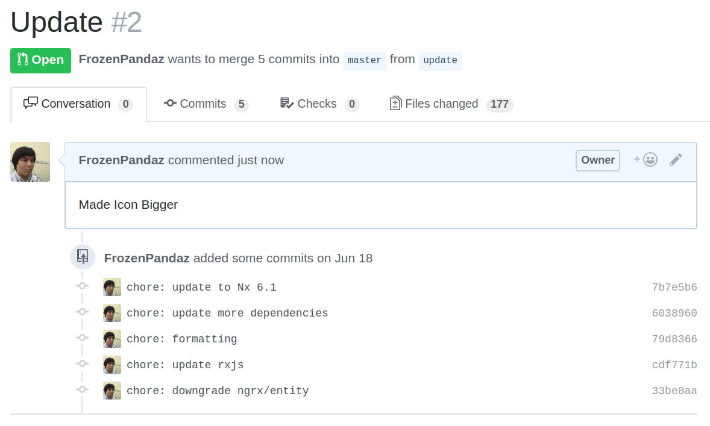
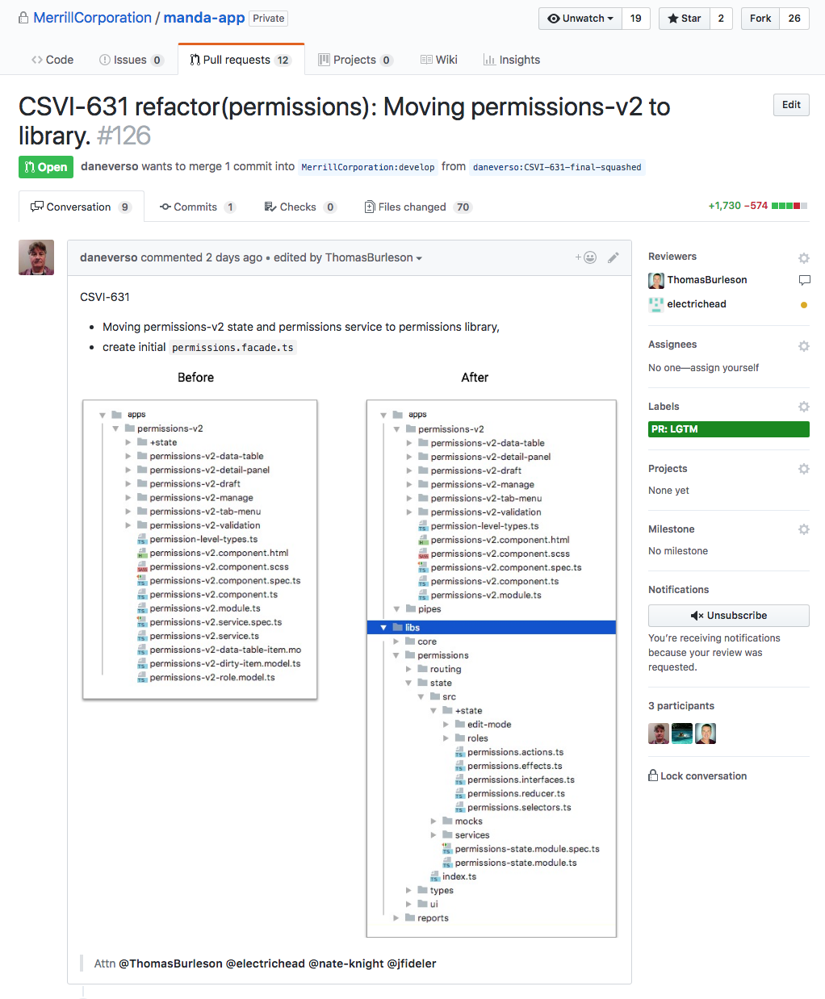
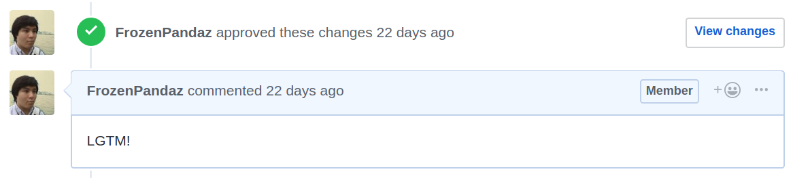
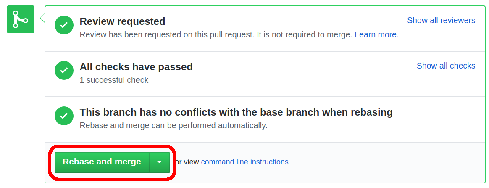

# PR Process

## Abstract

* Use the [PR Submission Checklist](../README.md#pr-submission-checklist) to check your changes before submitting a Pull Request.
* Use the [PR Review Checklist](../README.md#pr-review-checklist) to aid reviewing a Pull Request.
* Pull Requests **must** be approved by _at least_ the codeowner and another reviewer before being merged.

## Objectives

* Enhance functional quality.  Identify defects, security vulnerabilities, and performance optimizations.
* Enhance code quality and maintainability.  Identify improvements to readability and adherence to best practices adopted by Merrill.
* Increase cross-team knowledge of standards, techniques, and best practices among all experience levels.  Everyone can learn something!
* Code style enforcement handled by IDE code style template and tools such as checkstyle.
* Test coverage enforcement handled by SonarQube, though tests should be in scope for review.

## Before Making a Pull Request

> Use the [PR Submission Checklist](../README.md#pr-submission-checklist) to check your changes before submitting a Pull Request.

The developer should be reasonably confident the code is ready to be merged before making a Pull Request. Below are some things which should be checked locally **before** making a Pull Request.

## Making a Pull Request

The title of a pull request should be the same as the commit message. The description of a pull request should prepare the reviewer to review the code changes. Below should be the format to follow.

* Reference to Issue/Title
  * This is a link and title of the issue being resolved by the PR
  * This establishes a relationship from an issue to the code change
* Current Behavior
  * The current behavior should be described to compare to the expected behavior
  * A screenshot highlighting the issue is a great visual to include.
* Expected Behavior
  * The expected behavior after the change has been applied
  * This can also be a list of acceptance criteria
  * A screenshot showing the result should be included when UX is affected
* Affected projects (Optional)
  * This is a graph of the projects affected by this change
  * This is great for showing which apps are affected and need to be tested
* Alert relevant people
  * `@` mention the code owner and a reviewer

### Example of a Bad PR

* Title is not descriptive
* Description unclear as to which Icon got bigger
* No Screenshots to show before and after
* Multiple Commits in 1 PR
* No relevant people were notified

### Example of a Good PR

* Title has reference to the issue
* Before and After Screenshots to show change
* People are `@` mentioned

## Reviewing a Pull Request

> Use the [PR Review Checklist](../README.md#pr-review-checklist) to aid reviewing a Pull Request.

The goal of a reviewing a pull request is to ensure that the code changes are according to code standards and no unintended changes have been introduced. Below is a checklist of things the reviewer should keep in mind.

When the Pull Request meets the criteria above according to the reviewer, the reviewer should Approve the Pull Request and leave a comment with "LGTM".

## Merging a Pull Request

Pull Requests must be approved by _at least_ the code owner and reviewer before merging. When merging a pull request, the _Rebase and merge_ option must be used.

